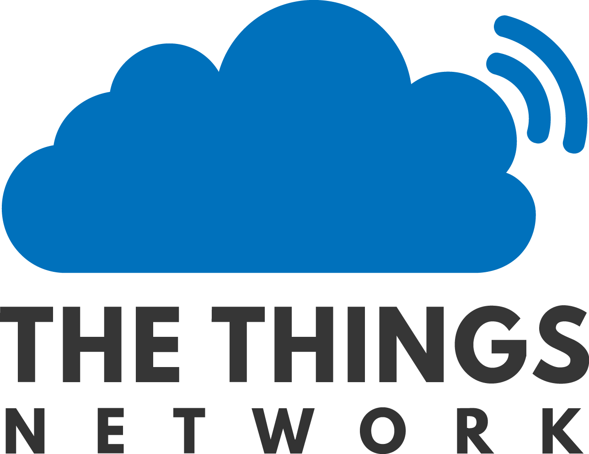
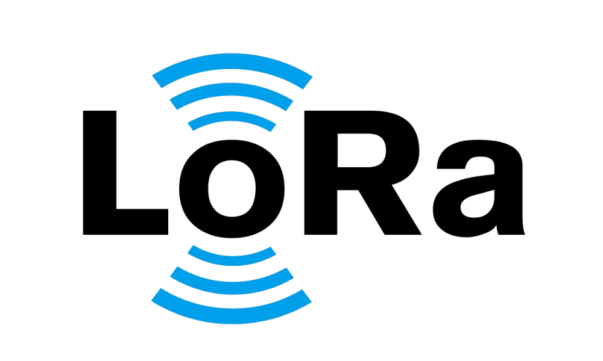
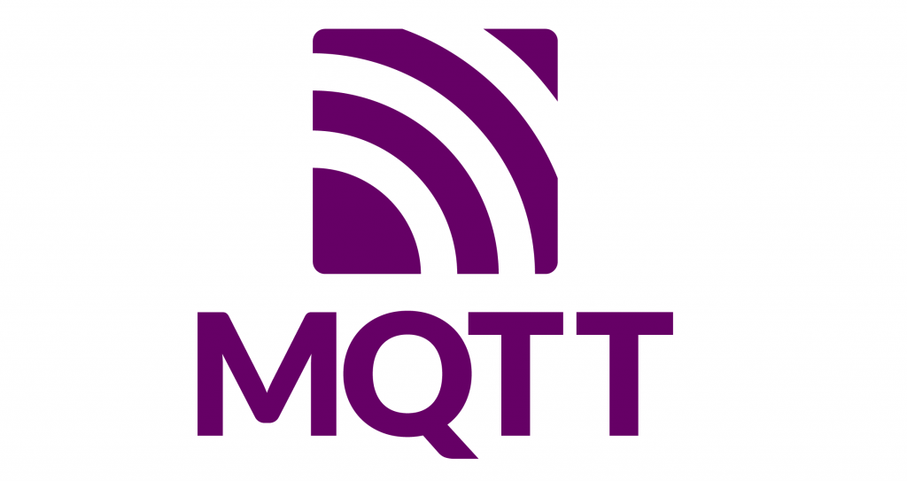
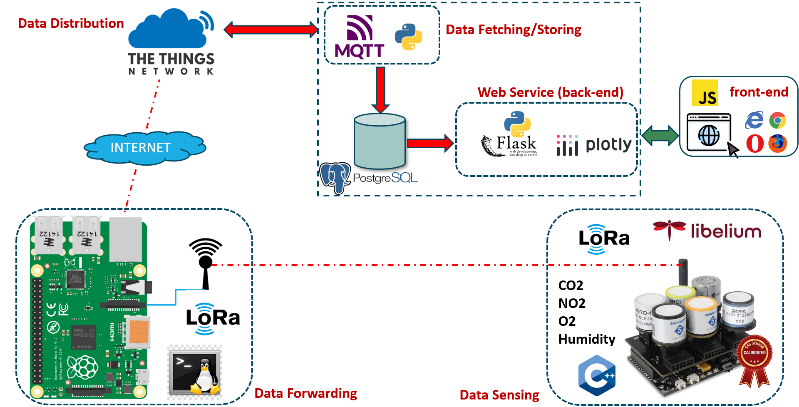
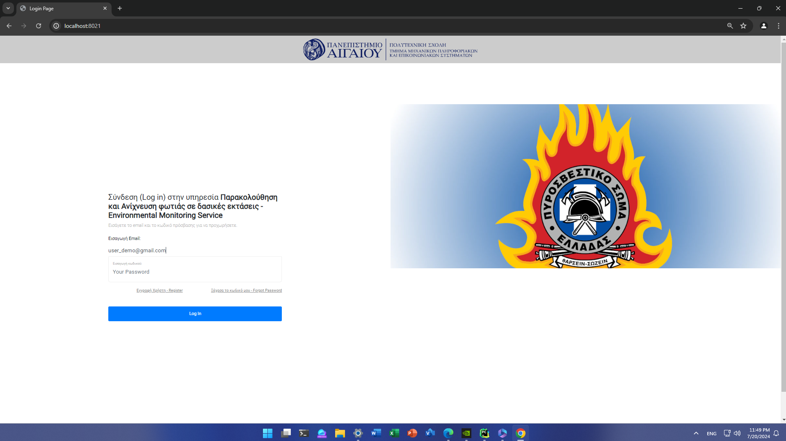
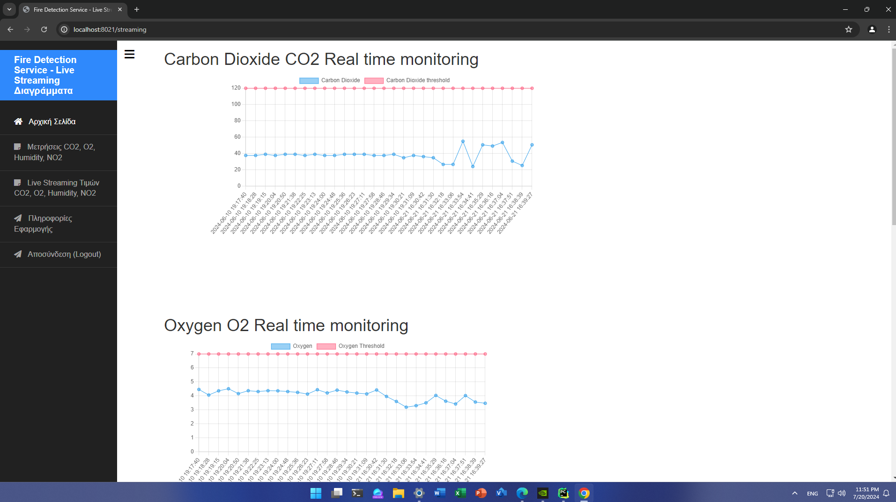

# Smart-IoT-based-Fire-Detection-Application

Our Smart IoT-based Fire Detection System is an innovative solution designed to enhance fire safety through advanced sensor technology and real-time data analytics. Utilizing high-precision sensors, LoRa communication, and powerful data visualization tools, our system offers reliable and timely detection of potential fire hazards. The system integrates Libelium sensor boards, a Raspberry Pi gateway, The Things Network (TTN), and PostgreSQL databases. High-precision sensors measure environmental factors such as CO2, humidity, O2, and NO2 levels. Data is transmitted over long distances using LoRa technology and processed through TTN, with all sensor data stored in a PostgreSQL database. Our custom Python services fetch this data, enabling comprehensive metric visualization and live-stream user interfaces. Users can securely log in to the web dashboard to monitor real-time metrics, view historical data trends, and receive threshold-based alerts for potential fire events. 

This robust and scalable system provides an essential tool for early fire detection, helping to prevent disasters and protect lives and property. Whether for individual users or public administration, our fire detection system leverages cutting-edge technology to deliver superior performance and peace of mind.

## All-in-One
Our concept utilizes an eco-friendly approach due to the fact that Libelium Waspmote is an ultra-low IoT power device opening the horizon for sustainability and low-cost solutions.
- Eco-friendly approach
-  Promoting sustainability both in terms of technological equipment
-  Open-source project for everyone! - **Always there is space for improvement!**
- Low-cost solution
- Scalable - **With just more Sensors or Libeliums, you have the sensors network you want!**
- Upgradable - **Any part can be upgraded**
- Agnostic-vendor - **It can play in any environment and in any geographical area of interest**


## Hardware, Software and Protocols
This project, combines concepts and technologies from physical layer such ar esp32, software layers such as Python, CSS and middle layer such as mosquitto protocol. Hardware, software and protocols are merged up together to create a web service in which the live state and the sensors metrics are being displayed. It is a 5-tier architecture.Specifically, our project includes these technologies per layer:

    [](https://skillicons.dev)

- Hardware: Libelium Waspmote board, Raspberry Pi 3 Model B+, O2-NO2-Humidity-CO2 Sensors
- Software: Python 3.10, CSS, HTML, JavaScript, CPP firmware
- Middleware: The Things Network, MQTT
- Web Layer: Flask-MQTT


## Application Architecture



### 1-Layer (Data Sensing)
The first layer of our system is data sensing. Using the Libelium Waspmote, we measure environmental parameters such as CO2, NO2, O2, and humidity. The Waspmote encodes these sensor readings through its shield interface and transmits them via a LoRa module to the next layer for further processing.

### 2-Layer (Data Forwarding)
The second layer of our IoT-based fire detection system is powered by a Raspberry Pi 3 Model B+. This layer is responsible for receiving sensor data transmitted by the Libelium Waspmote via a LoRa module. Once the Raspberry Pi captures the sensor values, it processes the data using custom scripts executed through Linux bash commands. The processed data is then streamed through the Raspberry Pi's Ethernet port, enabling it to be transmitted over the internet. This data is sent to The Things Network (TTN) service, which acts as the central hub for data aggregation and analysis. This setup ensures reliable and efficient communication between the sensor nodes and the cloud-based network, facilitating real-time monitoring and response to environmental conditions.

### 3-Layer (Data Distribution)
The third layer leverages The Things Network (TTN) service. This layer plays a crucial role in managing and processing the data received from the Raspberry Pi. Upon receiving the sensor data, TTN stores it in the user’s data catalog, ensuring organized and accessible records. TTN also handles the association between the data gateway and the user account, allowing for secure and efficient data management.

### 4-Layer (Data Fetching/Storing)
The fourth layer is a Python-based service responsible for data retrieval and storage. This service utilizes the MQTT protocol to connect to The Things Network (TTN) API, fetching sensor data from the user catalog every 2 seconds. Once retrieved, the data is processed and inserted into the 'Measurements' table of a PostgreSQL database. This setup ensures that sensor readings are continuously updated in the database, providing a reliable and up-to-date record of environmental conditions.

### 5-Layer (Web Service, back/front-end)
The fifth and final layer of our system is a Python Flask web service that provides a comprehensive user interface for interacting with the collected data. This layer includes several key features: it offers pages for plotting various metrics, allowing users to visualize and analyze sensor data trends over time; a live-stream values page to monitor real-time sensor readings and user authentication and registration functionalities to manage access and ensure secure interactions with the system. The front-end part resides on the user browser.


# App Execution

## Before Installation
*Please, before install all the necesseray libs and scripts, make sure that you have
the right hardware connected and that you are ready to start!*

- You better check these:

| Tools | Description |
| ---- | -------------------------------------------|
| [Libelium Waspmote](https://www.libelium.com/iot-products/waspmote/) | Libelium board responsible for data sensing executing CPP firmware|
| [Raspberry Pi 3 Model B+](https://www.raspberrypi.com/products/raspberry-pi-3-model-b-plus/) | Receiving via LoRa sensors values streaming them via Linux bash and transmiting them to the TTN|
| [SGX Sensors SGX-4OX, Oxygen Gas Sensor](https://gr.rsdelivers.com/product/sgx-sensors/sgx-4ox/sgx-sensors-sgx-4ox-oxygen-gas-sensor-ic-for-gas/2541602) | O2 Sensor|
| [SGX-4NO2AMPHENOL SGX SENSORTECH](https://www.tme.eu/en/details/sgx-4no2/gas-sensors/amphenol-sgx-sensortech/) | NO2 Sensor|
    
## Application Installation & Execution
Guidelines in case somebody wants to create this project and develop it in a real environment.
Want to contribute? Great!
### Phase A: Prepare App Environment
```sh
    [Libelium Waspmote]
    1. Connect the sensors into the shield
    2. Power on the Libelium
    3. Flash CPP firmware code to Waspmote
    4. Run the firmware code
    --------------------------------------
    [RASBPERRY PI]
    1. Power on Pi and connect to it (eg, SSH) 
    2. Connect the LoRa module
    3. Execute the Linux Shell commands
```

### Phase B: Install Python Libraries - Execute Python App
```sh
1. In the MQTT App, there is the requirements.txt file. You can execute, $: pip install -r <requirements.txt>
2. In the Environmentam monitoring App, there is the requirements.txt file. You can execute, $: pip install -r <requirements.txt>
```
*At the end of these scripts, you have to run the main.py in order to execute the application!*


## UserInterface (UI) Pages
The initial page, includes the authentication process. Also, the functionalities of user register and password forgot are being displayed. After the user authentication giving user email and password, the user can see the menu with the options.<br>

 <br> <br>
 Second page:



# People
Stefanos Plastras, alumni from University of the Aegean, and Lefteris Tsipis, were involved in the design, implementaion, testing and installation of this project.

## Stefanos Plastras
- Currently, he is doing his PhD studies in wireless networks. He holds a MEng from Dept. of Information and Communication Systems Engineering and a MSc from Athens University of Economics & Business.  
Email: s.plastras@gmail.com   
Github: [stevpla](https://github.com/steve-pla)

## Lefteris Tsipis
- Currently, he is doing his PhD studies in wireless networks and UAVs. He holds a MEng from Dept. of Information and Communication Systems Engineering and a MSc from the same university.  
Email: ltsipis@aegean.gr   
Github: [stevpla](https://github.com/steve-pla)


# License
The MIT License (MIT)

Copyright (c) 2023 Stefanos Plastras

Permission is hereby granted, free of charge, to any person obtaining a copy of this software and associated documentation files (the "Software"), to deal in the Software without restriction, including without limitation the rights to use, copy, modify, merge, publish, distribute, sublicense, and/or sell copies of the Software, and to permit persons to whom the Software is furnished to do so, subject to the following conditions:

The above copyright notice and this permission notice shall be included in all copies or substantial portions of the Software.

THE SOFTWARE IS PROVIDED "AS IS", WITHOUT WARRANTY OF ANY KIND, EXPRESS OR IMPLIED, INCLUDING BUT NOT LIMITED TO THE WARRANTIES OF MERCHANTABILITY, FITNESS FOR A PARTICULAR PURPOSE AND NONINFRINGEMENT. IN NO EVENT SHALL THE AUTHORS OR COPYRIGHT HOLDERS BE LIABLE FOR ANY CLAIM, DAMAGES OR OTHER LIABILITY, WHETHER IN AN ACTION OF CONTRACT, TORT OR OTHERWISE, ARISING FROM, OUT OF OR IN CONNECTION WITH THE SOFTWARE OR THE USE OR OTHER DEALINGS IN THE SOFTWARE.
